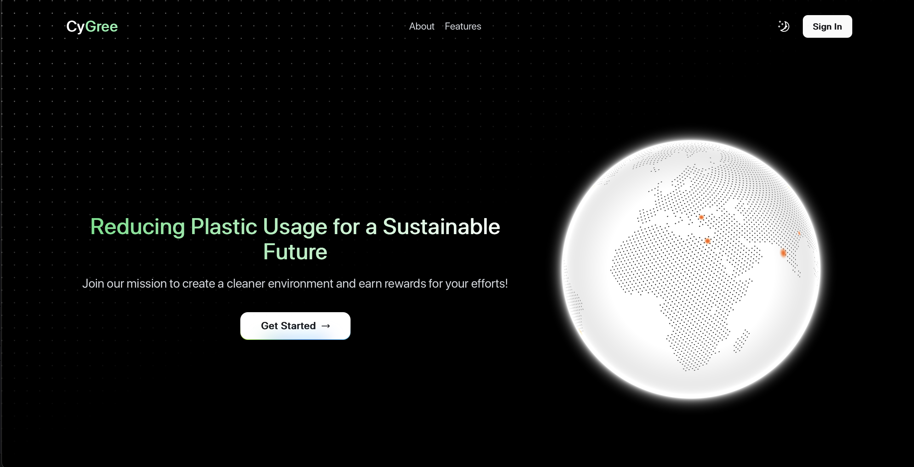
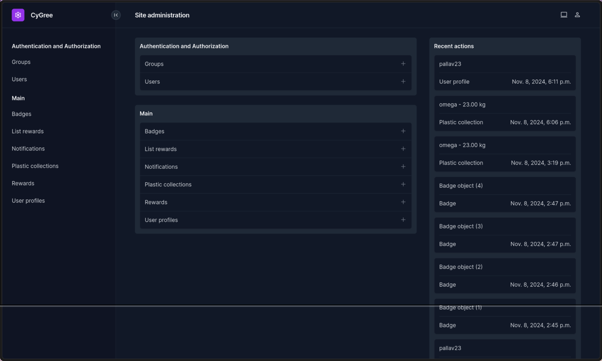
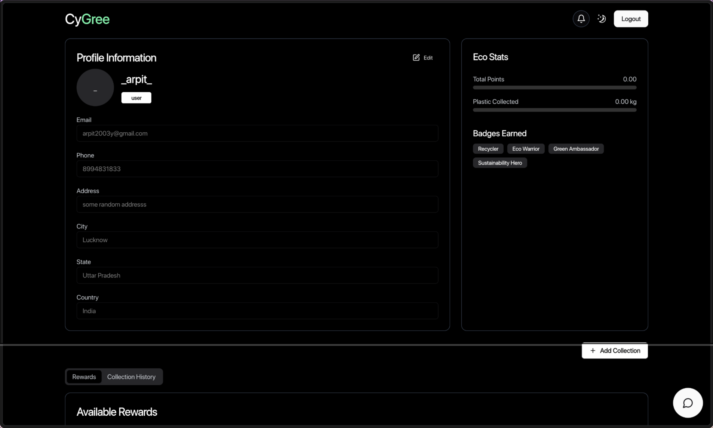
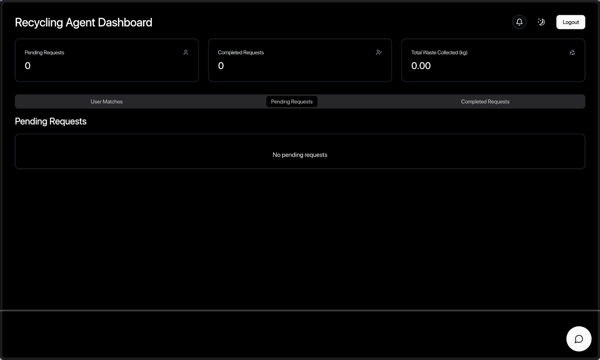
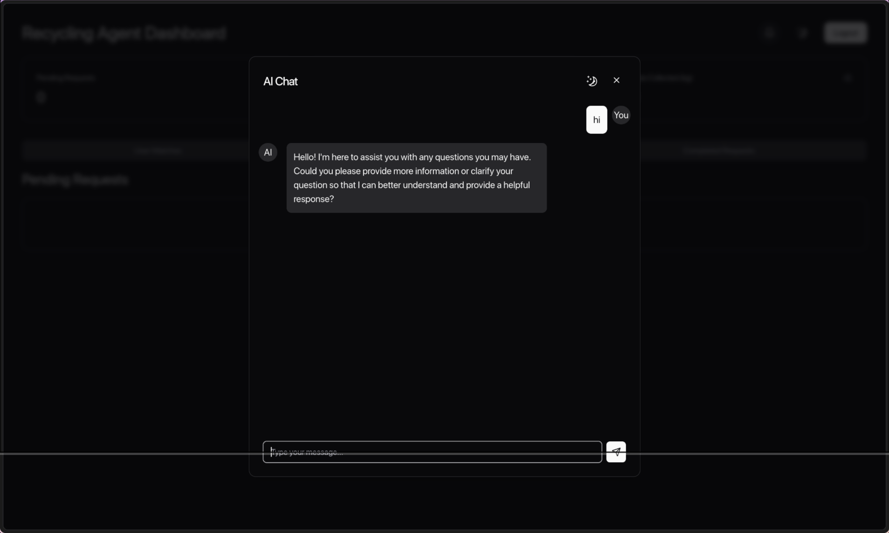

# <span style="color:gray;">Cy</span><span style="color:green;">Gree</span> : Plastic Waste Recycling Platform

Our project aims to contribute to environmental sustainability by reducing plastic waste. The solution incentivizes users to collect and submit their used plastic materials, which we will sell to recycling agents. In return, users will receive monetary gains in the form of gift coupons or special offers based on defined thresholds. This approach promotes environmental awareness while encouraging user participation in reducing plastic waste. The system leverages Vultr’s cloud services for scalability and secure data handling. By connecting users with recycling agents, we aim to create a sustainable ecosystem that reduces plastic waste, rewards positive behaviour, and supports the circular economy.

## API Documentation
- The API documentation for this project can be found [http://localhost:8000/api/docs](http://localhost:8000/api/docs) after successfully running the backend application

## Flows using Kestra

Kestra flows are stored in the `flows` folder of the project. Use the following command in the root of the project to spin up Kestra:

```bash
docker compose up -d
```

for more information visit Kestra [docs](https://kestra.io/docs).

## Getting Started

Initial Steps to get started with CyGree

### Clone the Repository

To get started, clone the repository to your local machine using the following command:

```bash
git clone https://github.com/xonoxc/cyGree.git
cd cyGree
```

# Frontend Application

```bash
  
   # In project root 
    npm install
   # run the development server 
    npm run dev

```


## Backend API Setup

Refer to README.md in backend folder

Open [http://localhost:8000](http://localhost:8000)(Default) with your browser to see the result.


## Technologies Used

- Application uses Next.js 13 and Django backend 
- Nginx (As a proxy server)

## Learn More

To learn more about Next.js, take a look at the following resources:
- [Next.js Documentation](https://nextjs.org/docs) - For Nextjs References
- [Django Documentation](https://docs.djangoproject.com/en/5.1/) -  For Django References

# Screenshots

### Home Page


### Admin Dashboard


### Client Dashboard (Collection Points & Rewards)


### Agent Dashboard


### Chatbot


## Contributing

For guidelines on contributing, please see the [CONTRIBUTING.md](./docs/CONTRIBUTING.md) file.
